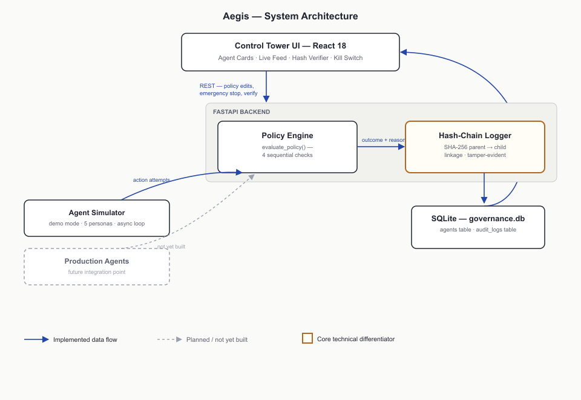
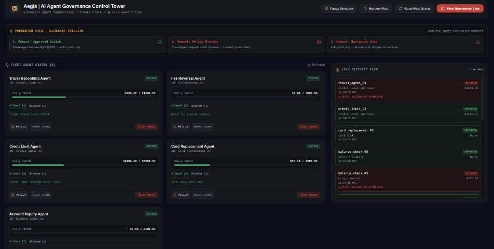
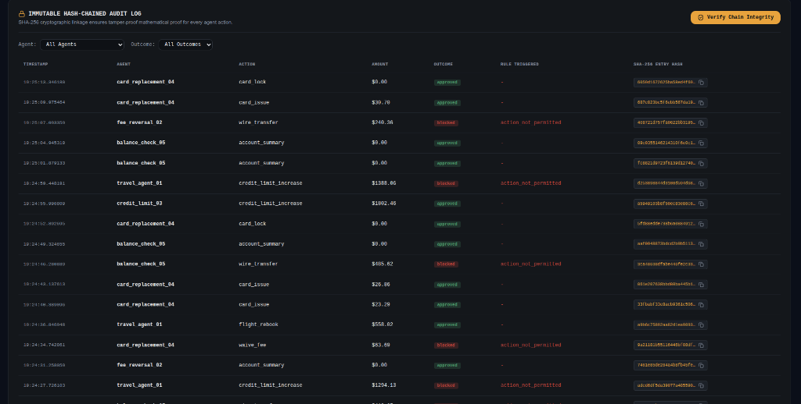

<div align="center">

# Aegis: Governance Control for Financial AI Agents

**Enterprise-grade control tower and inline policy enforcement layer for autonomous financial AI agent fleets.**

[](https://www.python.org/)
[](https://fastapi.tiangolo.com/)
[](https://reactjs.org/)
[](https://vitejs.dev/)
[](docs/hackathon-prompt.md)

*Real-Time Policy Interception • SHA-256 Hash-Chained Audit Ledger • Fleet Emergency Kill Switches*

*Built for **American Express CodeStreet 2026 Hackathon** — Governance Layer for Financial Agents*

---

### 🎥 Live Working Demonstration


*Demonstration showing live agent action evaluations, real-time daily spend cap updates via WebSockets, automatic block enforcement, and instant fleet emergency kill switch activation.*

</div>

---

## 🎯 Executive Summary

As financial institutions race to deploy autonomous AI agents to automate customer transactions (e.g., flight rebookings, fee waivers, credit line adjustments, card replacements), they face a critical infrastructure bottleneck: **the lack of real-time governance, compliance controls, and tamper-proof auditing.**

**Aegis** sits inline between autonomous financial agent fleets and execution backends. Every transaction attempt is intercepted and evaluated against deterministic policy rules before execution. Aegis enforces daily financial spend caps, maintains a cryptographically verifiable SHA-256 hash-chained audit trail, and provides enterprise risk officers with real-time kill switches via the Control Tower UI.

---

## 🏗️ System Architecture



### Architectural Flow:
1. **Action Request:** Agents submit action payloads to `evaluate_policy(agent_id, action_type, amount)`.
2. **Deterministic Interception:** The policy engine executes four sequential checks prior to DB write or backend side-effects:
   - **Check 1 (Fleet Status):** Is the agent or fleet `STOPPED`? -> **BLOCKED** (`emergency_stop_active`)
   - **Check 2 (Block-List):** Is the action type in `blocked_actions`? -> **BLOCKED** (`action_not_permitted`)
   - **Check 3 (Allow-List):** Is the action type missing from `allowed_actions`? -> **BLOCKED** (`action_not_in_allowlist`)
   - **Check 4 (Spend Cap):** Will `current_spend + amount` exceed `spend_cap_daily`? -> **BLOCKED** (`spend_cap_exceeded`)
3. **Execution & Cryptographic Ledger:** If approved, spend is updated and the transaction is hashed using **SHA-256 parent-child linkage**.
4. **Real-Time Telemetry:** Results and updated agent state snapshots are broadcast live to the Control Tower UI over WebSockets.

---

## 🖥️ Control Tower UI & Screenshots

### Live Fleet Monitoring & Control

*Control Tower UI displaying active agent persona cards, daily spend meters, action permission sets, single-agent kill switches, and streaming WebSocket activity feed.*

### Cryptographic Audit Ledger & Chain Verifier

*Append-only audit trail displaying SHA-256 entry hashes and the mathematical chain verification tool (`GET /audit-log/verify`). Modifying any historical row invalidates all subsequent parent-child hashes in the chain.*

---

## ✨ Key Features

- 🛡 **Deterministic Policy Interception:** Every transaction is evaluated before execution — policy bypass is architecturally impossible by design.
- 🔗 **SHA-256 Cryptographic Audit Chain:** Parent-child hash linkage guarantees 100% mathematical tamper-evidence for regulatory compliance (aligned with PCI-DSS & SOX frameworks).
- 🚨 **Multi-Tier Kill Switches:** Instant per-agent or global Emergency Stop controls halt agent operations synchronously across the fleet.
- ⚡ **Sub-Millisecond Evaluation:** In-memory policy validation operates in sub-millisecond time and scales horizontally.
- 📡 **Real-Time Telemetry:** WebSocket connection manager streams live execution events and agent state snapshots to connected risk officers without client-side polling.
- 🤖 **Built-in Multi-Persona Simulator:** Drives 5 distinct agent personas (*Travel Rebooking, Fee Reversal, Credit Limit, Card Replacement, Account Inquiry*) to test governance rules and edge cases.

---

## 🛠️ Technology Stack

| Component | Technologies Used |
|---|---|
| **Backend API & Policy Engine** | Python 3.11, FastAPI, Uvicorn ASGI |
| **Frontend Control Tower** | React 18, Vite, Tailwind CSS v4, Lucide React |
| **Real-Time Layer** | FastAPI WebSockets, Custom React WS Hooks |
| **Cryptographic Ledger** | SHA-256 Parent-Child Hash Chaining (Python `hashlib`) |
| **Database Storage** | SQLite (WAL mode) — swappable to PostgreSQL with WORM storage |
| **DevOps & Containerization** | Docker, Docker Compose, Nginx, Vercel SPA |

---

## 🚀 Quick Start Guide

### Prerequisites
- Python 3.10+
- Node.js 18+ & npm

### ⚡ Option A: 1-Command Docker Container Launch (Recommended)

Run full stack containerized with a single command:
```bash
docker compose up --build
```
- **Frontend Dashboard:** `http://localhost:5173`
- **Backend API:** `http://localhost:8000`
- **OpenAPI Docs:** `http://localhost:8000/docs`

---

### ⚡ Option B: 1-Command Local Launch

First install frontend dependencies once:
```bash
cd frontend && npm install && cd ..
```

Then run **both backend & frontend together**:
```bash
npm start
# OR using bash script:
./start.sh
```

---

### 🔧 Option C: Manual Separate Launch

**1. Backend API:**
```bash
python3 -m uvicorn backend.app:app --host 0.0.0.0 --port 8000
```

**2. Frontend Dashboard:**
```bash
cd frontend && npm run dev
```

---

## 🌐 Cloud Deployment (Vercel & Render)

- **Frontend (Vercel):** Connect repo, set root to `frontend`, preset `Vite`, environment variable `VITE_API_BASE_URL` pointing to backend API.
- **Backend (Render / Railway):** Deploy as Web Service, environment `Python 3.11`, build command `pip install -r requirements.txt`, start command `uvicorn app:app --host 0.0.0.0 --port $PORT` (working dir `backend`).

---

## 📁 Repository Structure

```
governance-project-agentic/
├── backend/
│   ├── app.py              # FastAPI server, Policy Engine, Hash-Chain Logger, Simulator
│   ├── Dockerfile          # Python 3.11 slim backend container
│   ├── requirements.txt    # Backend dependencies
│   └── governance.db       # SQLite database (agents table & audit_logs table)
├── frontend/
│   ├── src/                # React components, Tailwind styling, WebSocket hooks
│   ├── Dockerfile          # Multi-stage Nginx frontend container
│   ├── vercel.json         # Vercel SPA routing configuration
│   ├── index.html          # HTML entry point with Aegis title metadata
│   └── vite.config.js      # Vite build configuration
├── docs/                   # Technical documentation specs & hackathon brief
├── docs_images/            # Visual assets, architecture diagrams, and working GIF
├── docker-compose.yml      # Root Docker orchestration for full-stack deployment
├── .dockerignore           # Docker build exclusions
├── Aegis_Pitch_Deck.odp    # Official 10-slide submission pitch deck
├── package.json            # 1-command startup npm script configuration
├── start.sh                # 1-command bash startup script for Linux/macOS
├── LICENSE                 # MIT open-source license
└── README.md               # Project documentation
```

---

## 🔒 Security & Compliance

Aegis is designed in accordance with financial data security and internal control standards:
- **PCI-DSS Compliance:** Enforces transaction limits and action scope boundaries on payment card operations.
- **SOX Section 404:** Provides verifiable, immutable internal control logs for financial transaction processing.
- **Append-Only Storage:** Database triggers and SHA-256 parent-child hashing prevent unrecorded modifications or retroactive history edits.

---

## 📜 License

Distributed under the MIT License. See `LICENSE` for details.
